# Minn — Messenger App

**Minn** is a modern Android messenger application built with **Jetpack Compose** and **Firebase**, following **Clean Architecture** principles.

The app supports real-time messaging, user profiles, online status, and both light & dark themes.

---

## Features

- Authentication (Sign In / Sign Up)
- Real-time chat (Firebase Firestore)
- Chat list with last message & online status
- User search
- User profile & edit profile
- Online / last seen status
- Light & Dark themes
- Clean Architecture

---

## Tech Stack

- **Kotlin**
- **Jetpack Compose**
- **Navigation Compose**
- **ViewModel**
- **Hilt** (Dependency Injection)
- **Firebase**
  - Authentication
  - Firestore
- **Coil** (Image loading)
- **Material 3**
- **Coroutines & Flow**

### 💬 Chat
| Light | Dark |
|------|------|
| 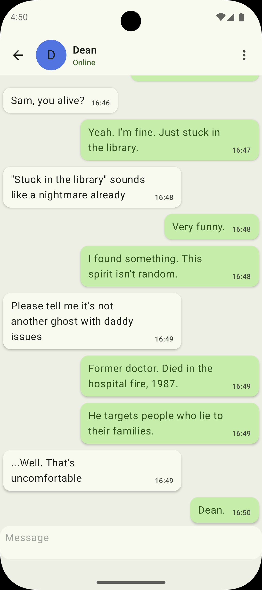 | 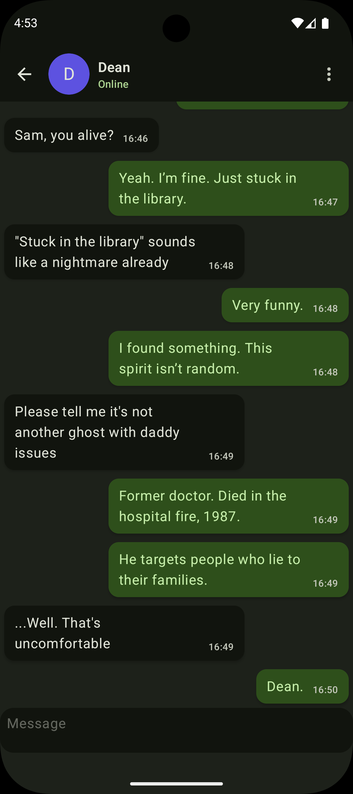 |

### 📋 Chat List
| Light | Dark |
|------|------|
|  | 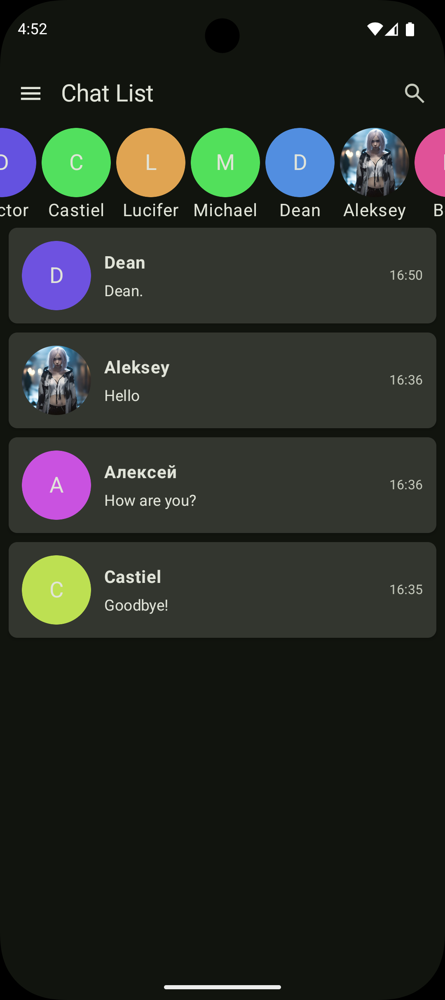 |

### Sign In
| Light | Dark |
|------|------|
| 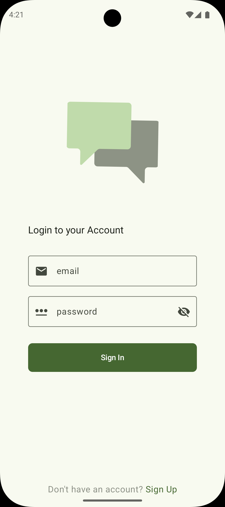 | 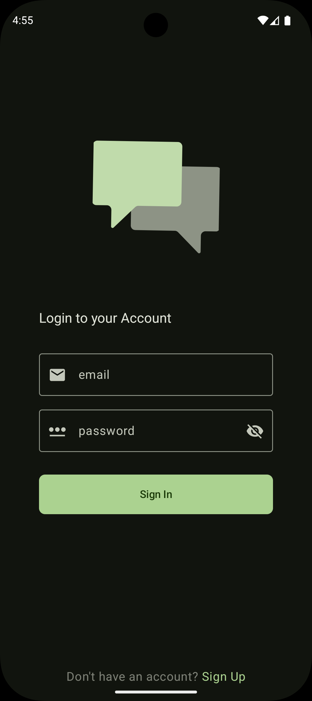 |

### 📝 Sign Up
| Light | Dark |
|------|------|
| 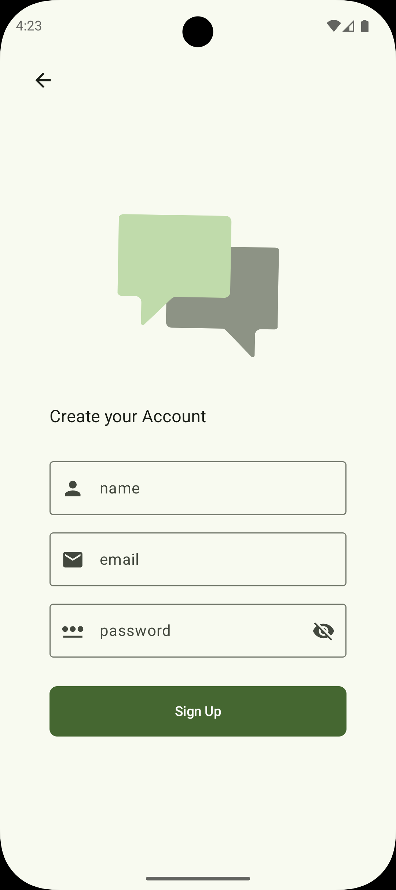 |  |

### Search
| Light | Dark |
|------|------|
| 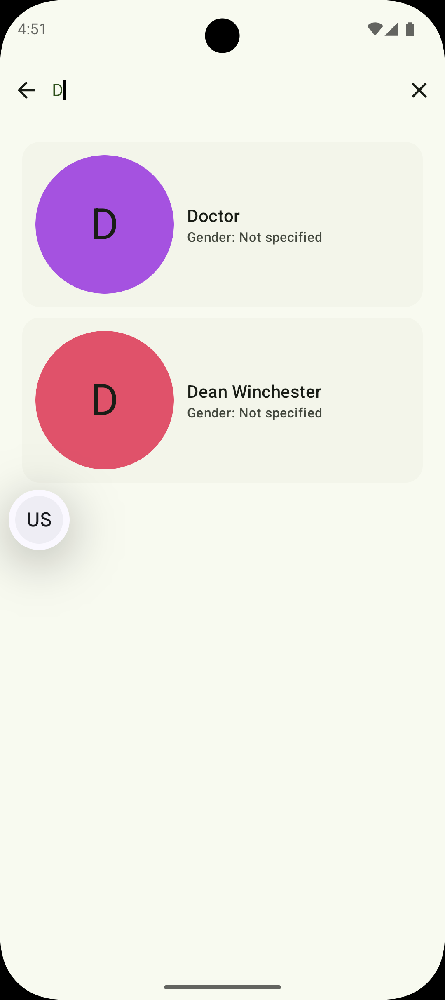 | 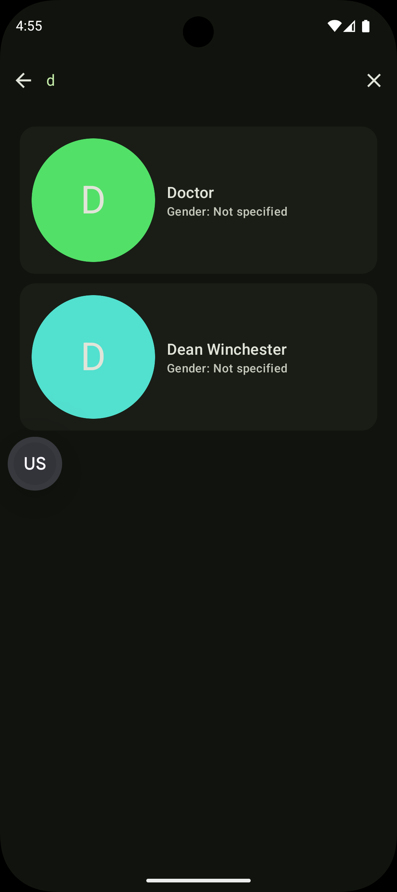 |

### Profile
| Light | Dark |
|------|------|
| 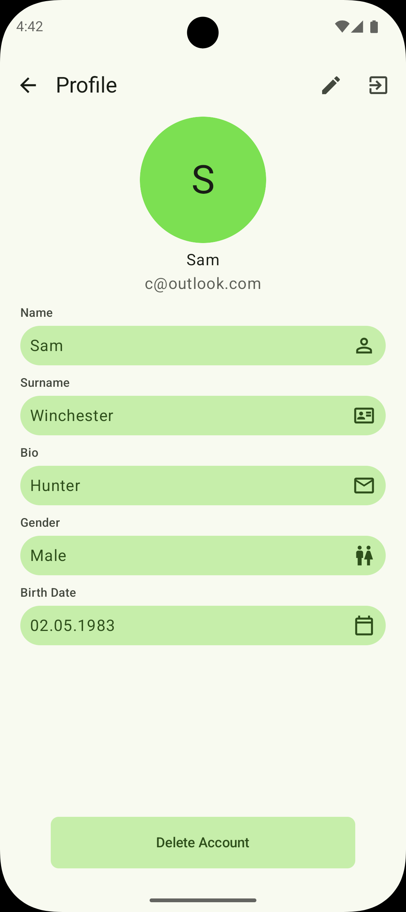 | 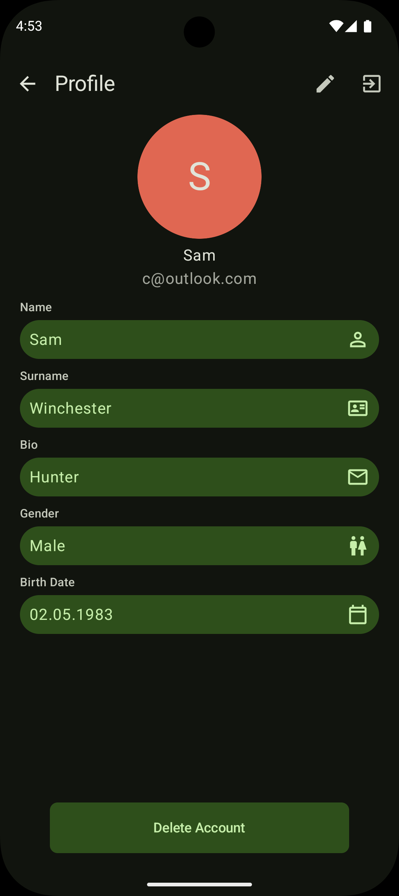 |

### Edit Profile
| Light | Dark |
|------|------|
| 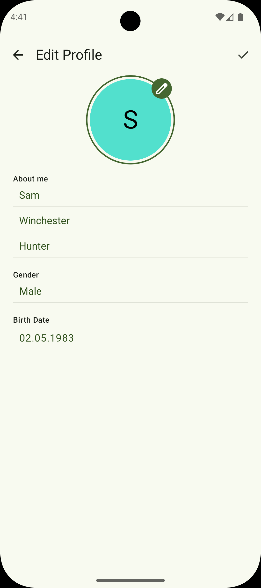 | 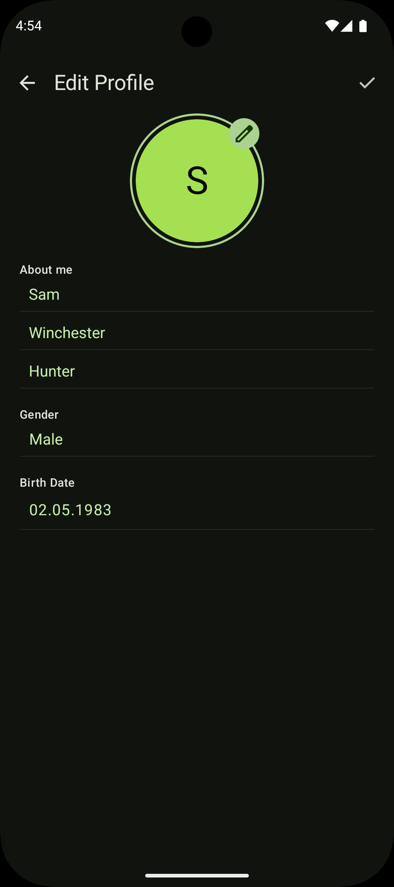 |
